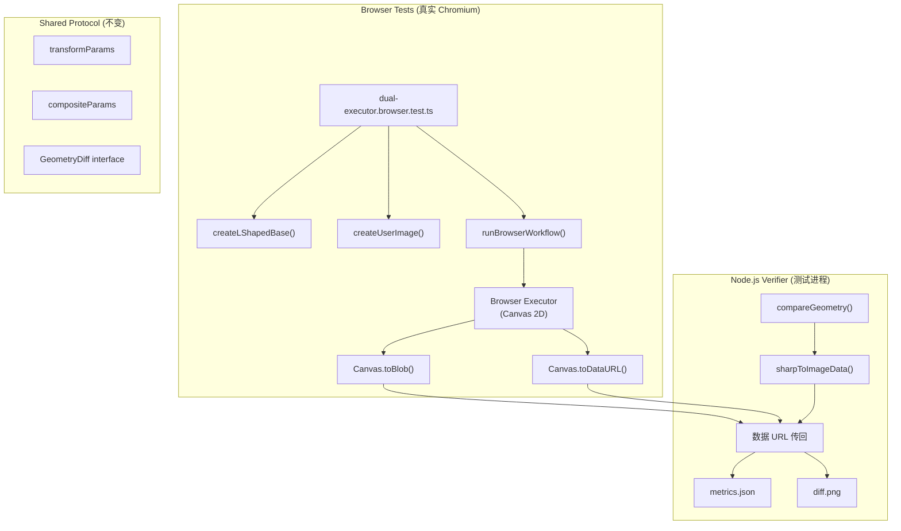
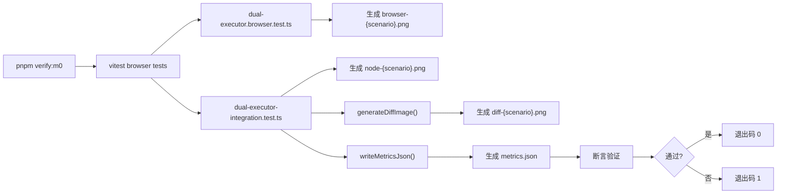

# M0 真实浏览器闭环修复 — 实施计划

## 背景

M0 最终证据审计结论：**C - FAIL**

核心问题：
1. 当前所有测试在 `environment: 'node'` 中运行，使用 `canvas` npm polyfill
2. 不存在跨运行时（Real Browser vs Node）对比
3. 无可视化证据（browser.png / node.png / diff.png / metrics.json）
4. `vitest.browser.config.ts` 存在但未被使用

---

## 一、OpenSpec 内容校正

### 1.1 当前状态

`openspec/changes/m0-dual-runtime-reproduction/.openspec.yaml` 第 12 行：
```yaml
status: completed
```

需要更新为 `status: in_progress`，并添加新的验收 gate。

### 1.2 新增验收 Gate

| Gate ID | 名称 | 验收条件 |
|---------|------|----------|
| `browser-real-chromium` | Real Chromium 执行 | 浏览器测试在真实 Chromium 进程执行 |
| `browser-output-artifacts` | 浏览器输出证据 | browser.png 已写入 `artifacts/verification/M0/` |
| `node-output-artifacts` | Node 输出证据 | node.png 已写入 |
| `diff-artifacts` | Diff 证据 | diff.png 已写入 |
| `metrics-artifacts` | 指标证据 | metrics.json 已写入 |
| `alpha-format-correct` | Alpha 格式正确 | detectAlphaFormat 逻辑正确 |
| `mutation-tests` | 变异测试 | 至少覆盖 5 种错误注入场景 |

### 1.3 任务状态更新

`tasks.md` 中的任务状态需要重置：

| Task | 原状态 | 新状态 | 说明 |
|------|--------|--------|------|
| T5 | completed | in_progress | 需要补充真实浏览器测试 |

---

## 二、架构设计

### 2.1 整体架构



### 2.2 Browser 输出安全传回 Node Verifier

Browser 测试在 Chromium 进程中运行，通过 `canvas.toDataURL('image/png')` 将 `ImageData` 编码为 base64 data URL。此 data URL 作为测试断言结果的一部分返回到 Node.js 测试进程，在 Node 端解码为 `Uint8ClampedArray`，由 `compareGeometry` 处理。

**安全边界**：
- Browser 端只生成像素数据，不处理业务逻辑
- Node 端负责所有验证、diff 计算和文件写入
- 不存在跨进程共享内存

---

## 三、实施步骤

### Step 1：创建 Browser 测试文件（无 canvas polyfill）

**文件**：`packages/image-ops/src/dual-executor.browser.test.ts`

**核心设计**：
- 使用 Vitest Browser Mode，配置 `vitest.browser.config.ts`
- Browser 测试文件导入 `browser/TransformExecutor`、`browser/CompositeExecutor`
- **禁止**导入或依赖 `test-setup.ts`（该文件注入 canvas npm polyfill）
- Browser 测试直接使用原生 `ImageData`、`OffscreenCanvas`、`canvas` API

**Browser 测试覆盖**：

| 测试场景 | 说明 |
|----------|------|
| `identity: browser produces valid ImageData` | Browser 路径生成正确尺寸 ImageData |
| `scale-2x: browser produces valid ImageData` | 缩放场景 |
| `rotate-90: browser produces valid ImageData` | 旋转场景 |
| `browser: geometric metrics computed correctly` | 几何指标计算 |
| `browser: deterministic (same input = same output)` | 确定性验证 |

**输出接口**（保持与 Node 一致）：
```typescript
interface BrowserWorkflowResult {
  imageData: ImageData;
  width: number;
  height: number;
  metrics: GeometryMetrics;
  // base64 data URL for cross-process transfer
  dataUrl: string;
}
```

**验收条件**：测试在 Chromium 中通过，输出 data URL。

---

### Step 2：更新 vitest.browser.config.ts

**文件**：`packages/image-ops/vitest.browser.config.ts`

**修改内容**：
```typescript
import { defineConfig } from 'vitest/config';
import { fileURLToPath } from 'url';
import { dirname, resolve } from 'path';

const __filename = fileURLToPath(import.meta.url);
const __dirname = dirname(__filename);

export default defineConfig({
  test: {
    globals: true,
    name: 'worker-browser',
    include: ['src/**/*.browser.test.ts'],  // 改为 .browser.test.ts
    testTimeout: 30000,
    // 不使用 setupFiles，避免加载 canvas npm polyfill
    setupFiles: [],  // 空数组，不加载 test-setup.ts
    browser: {
      enabled: true,
      name: 'chromium',
      provider: 'playwright',
    },
  },
  server: {
    fs: { strict: false },
  },
});
```

**关键约束**：
- `setupFiles: []` — 禁止加载 `test-setup.ts`
- Browser 测试必须使用原生浏览器 API
- 不能依赖任何 Node.js 特定 API

---

### Step 3：保留 Node-hosted Executor Parity Tests

**文件**：`packages/image-ops/src/dual-executor-consistency.test.ts`

**保留内容**：
- Node ↔ Node 确定性测试（`deterministic — Node`）
- 几何指标计算正确性测试
- Fixture 验证测试

**删除内容**：
- Browser ↔ Node 对比测试（因为 Browser 当前是假的）

**新文件路径**：`packages/image-ops/src/dual-executor-parity.test.ts`

保留现有 18 个测试中的约 10 个（Node 确定性 + 几何指标 + Fixture 验证）。

---

### Step 4：创建 Node + Sharp Verifier

**文件**：`packages/image-ops/src/verify/m0-verifier.ts`

**功能**：
1. 接收 Browser 端返回的 base64 data URL
2. 接收 Node 端执行结果
3. 调用 `compareGeometry()` 计算几何差异
4. 生成 diff.png（使用 sharp）
5. 写入 metrics.json

```typescript
export async function verifyM0Artifact(
  browserDataUrl: string,
  nodeImageData: ImageData,
  scenarioName: string
): Promise<{
  diff: GeometryDiff;
  diffImagePath: string;
  metricsPath: string;
}> {
  // 1. 解码 Browser 输出
  const browserImageData = await dataUrlToImageData(browserDataUrl);

  // 2. 计算几何差异
  const diff = compareGeometry(browserImageData, nodeImageData, GEOMETRY_TOLERANCE);

  // 3. 生成 diff.png
  const diffPath = await generateDiffImage(browserImageData, nodeImageData, scenarioName);

  // 4. 写入 metrics.json
  const metricsPath = await writeMetricsJson(diff, scenarioName);

  return { diff, diffImagePath: diffPath, metricsPath };
}
```

**输出路径**：`artifacts/verification/M0/`

| 文件 | 说明 |
|------|------|
| `browser-{scenario}.png` | Browser 端输出 |
| `node-{scenario}.png` | Node 端输出 |
| `diff-{scenario}.png` | 差异可视化 |
| `metrics.json` | 指标汇总 |

---

### Step 5：创建综合集成测试

**文件**：`packages/image-ops/src/dual-executor-integration.test.ts`

该文件在 Node.js 环境中运行，协调 Browser 和 Node 两端：

```typescript
describe('M0 Real Browser Integration', () => {
  for (const scenario of SCENARIOS) {
    it(`${scenario.name}: browser vs node geometry`, async () => {
      // 1. 在 Browser 中运行
      const browserResult = await runBrowserWorkflow(scenario.params);

      // 2. 在 Node 中运行
      const nodeResult = await runNodeWorkflow(scenario.params);

      // 3. 调用 Verifier
      const { diff, diffImagePath, metricsPath } = await verifyM0Artifact(
        browserResult.dataUrl,
        nodeResult.imageData,
        scenario.name
      );

      // 4. 断言
      expect(diff.centerDeltaNorm).toBeLessThan(GEOMETRY_TOLERANCE.centerNorm);
      expect(diff.colorDiffPercent).toBeLessThan(GEOMETRY_TOLERANCE.colorDiffPercent);
    });
  }
});
```

**运行方式**：Vitest Browser Mode（`pnpm test:browser`）

---

### Step 6：添加 mutation tests（负向测试）

**文件**：`packages/image-ops/src/mutation/m0-mutation.test.ts`

**测试场景**：

| 错误注入 | 预期结果 | 阈值敏感度 |
|----------|----------|------------|
| translateX +2px | centerDeltaNorm 显著增加 | 0.5px |
| translateX +3px | centerDeltaNorm 更显著 | 1px |
| scaleX ×1.01 | dimensionNorm 超阈值 | 0.5% |
| scaleX ×1.02 | dimensionNorm 明显超阈值 | 1% |
| rotation 反向（-90°） | alphaEdgeDeltaPx 大幅增加 | 2px |

**实现方式**：
- 使用故意错误的参数运行两端正对比
- 断言差异超过阈值
- 验证测试能捕获这些错误

---

### Step 7：verify:m0 命令

**文件**：`packages/image-ops/package.json`

```json
{
  "scripts": {
    "verify:m0": "vitest run --config vitest.browser.config.ts src/dual-executor-integration.test.ts && vitest run src/dual-executor-parity.test.ts"
  }
}
```

**完整执行流程**：



---

## 四、detectAlphaFormat 处理方案

### 4.1 当前逻辑

```typescript
// core/alpha-format.ts
export function detectAlphaFormat(pixels: ImageData): 'premultiplied' | 'straight' {
  // 仅采样前 100 像素
  for (let i = 0; i < limit; i += 4) {
    if (a > 0 && a < 255) {
      if (r <= a && g <= a && b <= a) return 'premultiplied';
      if (r > a || g > a || b > a) return 'straight';
    }
  }
  return 'straight';  // 默认保守处理
}
```

### 4.2 问题分析

| 问题 | 影响 |
|------|------|
| 仅采样前 100 像素 | 可能误判大面积相同色值图片 |
| 灰色像素 (R=G=B=A) | 被判定为 premultiplied（保守处理） |
| 无回归测试 | 依赖双端测试间接覆盖 |

### 4.3 处理方案

**方案 A（推荐）**：增加独立回归测试，不改变公共协议

文件：`packages/image-ops/src/core/alpha-format.test.ts`

```typescript
describe('detectAlphaFormat', () => {
  it('detects premultiplied correctly for gradient alpha', () => {
    // 创建半透明渐变 premultiplied 像素
    const pixels = createPremultipliedGradient();
    expect(detectAlphaFormat(pixels)).toBe('premultiplied');
  });

  it('detects straight correctly for gradient alpha', () => {
    const pixels = createStraightGradient();
    expect(detectAlphaFormat(pixels)).toBe('straight');
  });

  it('handles fully opaque pixels', () => {
    const pixels = createFullyOpaque();
    expect(detectAlphaFormat(pixels)).toBe('straight'); // 保守
  });

  it('handles gray at 50% alpha', () => {
    const pixels = createGrayAtFiftyPercent();
    expect(detectAlphaFormat(pixels)).toBe('premultiplied'); // 保守
  });
});
```

**方案 B（阻塞项）**：如果需要修改 `detectAlphaFormat` 的返回值类型或语义

- 需要修改 `@prism/shared-types` 中的类型定义
- 属于公共协议变更
- **标记为阻塞项，不能在 M0 阶段修改，必须在 M1 处理**

### 4.4 本计划采用方案 A

不修改 `alpha-format.ts` 的公共接口，仅添加回归测试。

---

## 五、文件变更清单

### 5.1 新增文件

| 文件路径 | 说明 |
|----------|------|
| `packages/image-ops/src/dual-executor.browser.test.ts` | 浏览器端独立测试 |
| `packages/image-ops/src/dual-executor-integration.test.ts` | 跨端集成测试 |
| `packages/image-ops/src/dual-executor-parity.test.ts` | Node 确定性测试（从原文件拆分） |
| `packages/image-ops/src/mutation/m0-mutation.test.ts` | 变异测试 |
| `packages/image-ops/src/verify/m0-verifier.ts` | Node 端验证器 |
| `packages/image-ops/src/verify/diff-generator.ts` | diff.png 生成器 |
| `packages/image-ops/src/core/alpha-format.test.ts` | alpha 格式回归测试 |

### 5.2 修改文件

| 文件路径 | 修改内容 |
|----------|----------|
| `packages/image-ops/vitest.browser.config.ts` | `include` 改为 `*.browser.test.ts`，`setupFiles: []` |
| `packages/image-ops/package.json` | 添加 `verify:m0` 脚本 |
| `openspec/changes/m0-dual-runtime-reproduction/tasks.md` | 重置 T5 状态，添加新任务 |
| `openspec/changes/m0-dual-runtime-reproduction/.openspec.yaml` | `status: in_progress`，新增 gate |
| `artifacts/verification/M0/verification.json` | 更新 gate 状态 |

### 5.3 预期 git diff 文件清单

```
A packages/image-ops/src/dual-executor.browser.test.ts
A packages/image-ops/src/dual-executor-integration.test.ts
A packages/image-ops/src/dual-executor-parity.test.ts
A packages/image-ops/src/mutation/m0-mutation.test.ts
A packages/image-ops/src/verify/m0-verifier.ts
A packages/image-ops/src/verify/diff-generator.ts
A packages/image-ops/src/core/alpha-format.test.ts
M packages/image-ops/vitest.browser.config.ts
M packages/image-ops/package.json
M openspec/changes/m0-dual-runtime-reproduction/tasks.md
M openspec/changes/m0-dual-runtime-reproduction/.openspec.yaml
M artifacts/verification/M0/verification.json
```

---

## 六、任务分解表

| 任务 | 修改文件 | 验收命令 | 通过条件 | 失败时是否停止 |
|------|----------|----------|----------|----------------|
| T6.1 | `dual-executor.browser.test.ts` | `pnpm verify:m0` (阶段1) | Chromium 进程启动，无 canvas polyfill 错误 | **是** |
| T6.2 | `vitest.browser.config.ts` | `pnpm verify:m0` (阶段2) | Browser 测试运行，setupFiles 为空 | **是** |
| T6.3 | `dual-executor-parity.test.ts` | `vitest run src/dual-executor-parity.test.ts` | Node 确定性测试全部通过 | **是** |
| T6.4 | `m0-verifier.ts` + `diff-generator.ts` | `pnpm verify:m0` (阶段3) | metrics.json 生成，diff.png 存在 | **是** |
| T6.5 | `dual-executor-integration.test.ts` | `pnpm verify:m0` | browser vs node 几何差异 < 阈值 | **是** |
| T6.6 | `m0-mutation.test.ts` | `vitest run src/mutation/m0-mutation.test.ts` | 错误注入测试全部通过 | **否**（可跳过） |
| T6.7 | `alpha-format.test.ts` | `vitest run src/core/alpha-format.test.ts` | alpha 格式回归测试通过 | **是** |
| T6.8 | `openspec/tasks.md` + `.openspec.yaml` | N/A（文档更新） | OpenSpec 内容与实现一致 | **是** |
| T6.9 | `verification.json` | N/A（报告更新） | 所有 gate 状态正确 | **是** |

---

## 七、约束检查

| 约束 | 状态 | 说明 |
|------|------|------|
| 不创建新的 OpenSpec change | ✅ | 继续现有 `m0-dual-runtime-reproduction` |
| 不修改 Mall scope | ✅ | 无 Mall 相关修改 |
| 不修改 M1 内容 | ✅ | M1 相关文档未修改 |
| 不修改目标架构文档 | ✅ | `PRISM_TARGET_ARCHITECTURE.md` 未修改 |
| 不修改控制中心 scope 配置 | ✅ | 无控制中心相关修改 |
| 不新增依赖 | ✅ | 仅使用已安装的 `@vitest/browser` + `playwright` |
| 不修改锁文件 | ✅ | 无 pnpm-lock.yaml 修改 |
| 不修改公共协议 | ✅ | 仅添加回归测试，不改变类型定义 |

---

## 八、阻塞项识别

| 阻塞项 | 原因 | 解决方案 |
|--------|------|----------|
| 无 | 本计划不涉及公共协议修改 | N/A |

如在实施过程中发现需要修改 `@prism/shared-types` 中的类型定义，必须：
1. 停止当前实施
2. 记录阻塞项
3. 在 M1 阶段处理
4. M0 不得进入 M1 直到阻塞项解决

---

## 九、最终验收条件

M0 真实浏览器闭环修复完成的充要条件：

1. `pnpm verify:m0` 退出码 0
2. `artifacts/verification/M0/` 包含：
   - `browser-{scenario}.png` × 5
   - `node-{scenario}.png` × 5
   - `diff-{scenario}.png` × 5
   - `metrics.json`
3. `verification.json` 所有 gate 状态为 `PASS`
4. `openspec/changes/m0-dual-runtime-reproduction/.openspec.yaml` 状态为 `completed`
5. 无新增依赖、无锁文件修改

---

## 十、预计工作量

| 阶段 | 文件数 | 预计代码行数 |
|------|--------|--------------|
| Browser 测试基础设施 | 1 | ~150 |
| Node 确定性测试 | 1 | ~100 |
| 跨端集成测试 | 1 | ~120 |
| Verifier | 2 | ~100 |
| Mutation 测试 | 1 | ~80 |
| Alpha 回归测试 | 1 | ~60 |
| 配置更新 | 2 | ~20 |
| OpenSpec 更新 | 2 | ~50 |
| **总计** | **11** | **~680** |